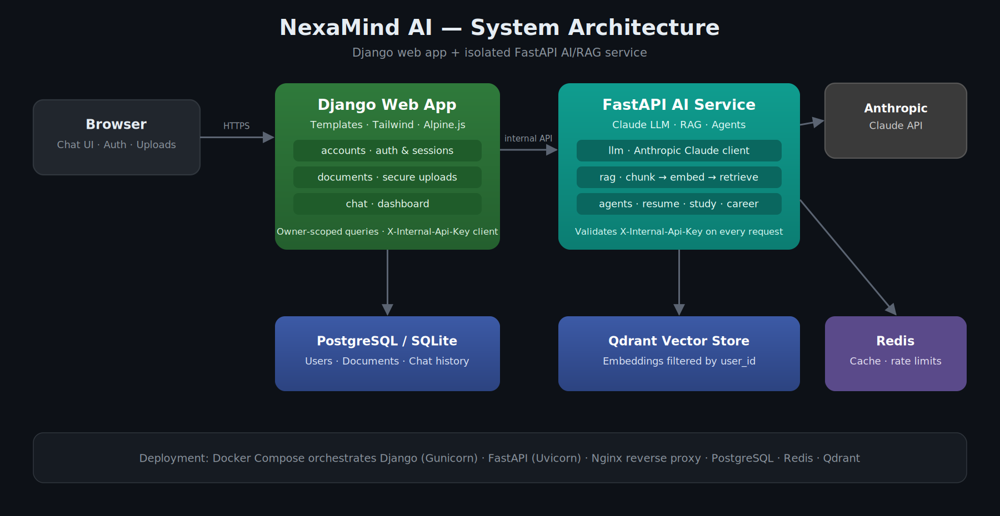
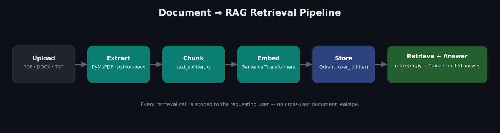
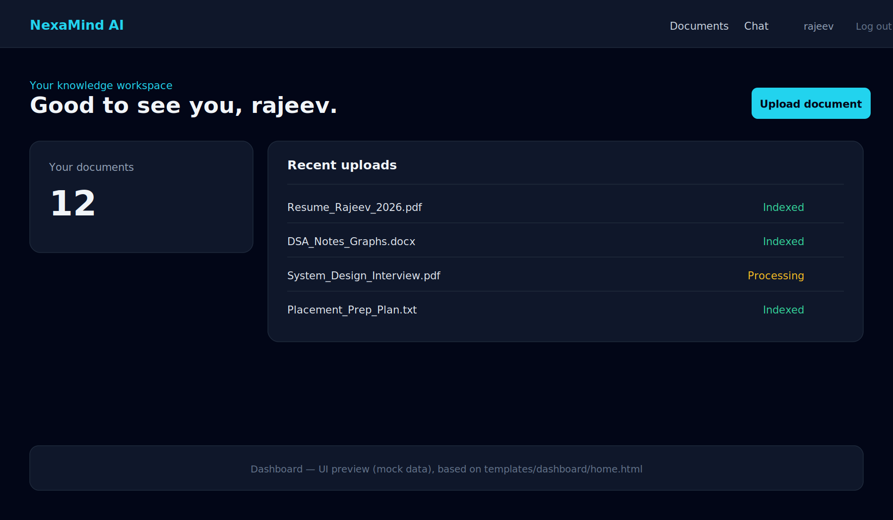
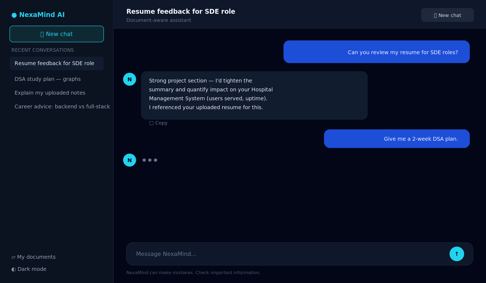
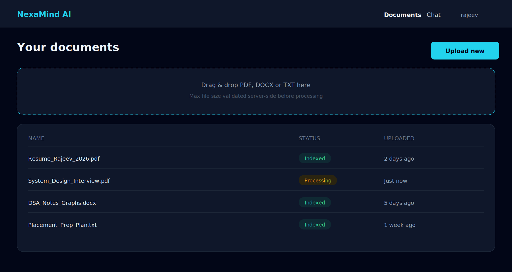
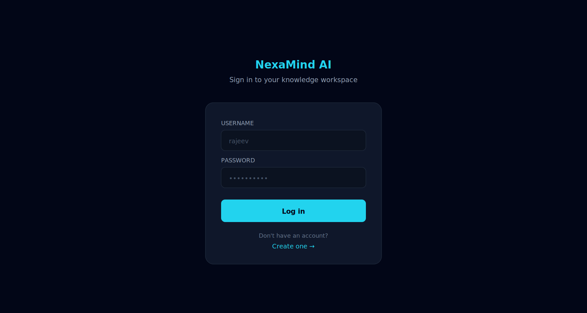

<div align="center">

# 🧠 NexaMind AI

**A full-stack AI knowledge & career assistant** — document-aware chat, resume analysis, and personalized study/career plans, built on a Django + FastAPI microservice architecture.

[](https://www.python.org/)
[](https://www.djangoproject.com/)
[](https://fastapi.tiangolo.com/)
[](https://www.anthropic.com/)
[](https://qdrant.tech/)
[](https://www.docker.com/)
[](#license)

[Overview](#-overview) • [Architecture](#-architecture) • [Features](#-features) • [Tech Stack](#-tech-stack) • [Getting Started](#-getting-started) • [API Reference](#-internal-ai-api) • [Security](#-security) • [Roadmap](#-roadmap)

</div>

---

## 📖 Overview

**NexaMind AI** pairs a Django web application with an isolated **FastAPI AI/RAG microservice**. Users register, upload documents (PDF/DOCX/TXT), and chat with an AI assistant that is aware of their own document context — powered by Anthropic Claude and a Retrieval-Augmented Generation (RAG) pipeline backed by Qdrant.

Beyond chat, NexaMind includes career-focused AI agents:

- 📄 **Resume Analyzer** — structured, actionable feedback on an uploaded resume
- 🎯 **Study Plan Generator** — personalized learning roadmaps
- 💼 **Career Advisor** — contextual career guidance

The two services communicate over an internal, API-key-authenticated channel — the browser never touches Anthropic credentials or internal secrets.

---

## 🏗️ Architecture

<p align="center">
  
</p>

```text
Browser → Django (auth, templates, uploads) → FastAPI (Claude, RAG, agents)
               │                                  │
        SQLite / PostgreSQL                 Qdrant vectors
```

- **Django** owns authentication, sessions, document uploads, chat UI, and the dashboard. All document and chat queries are strictly scoped to the authenticated owner.
- **FastAPI** owns everything AI: the Claude client, the RAG pipeline, and the career agents. It validates every request with an `X-Internal-Api-Key` header issued only to the Django backend.
- **Qdrant** stores document embeddings, always filtered by `user_id`, so retrieval never leaks another user's data.
- **Redis** backs caching and rate limiting on the AI service.
- **Docker Compose + Nginx** tie the whole stack together for production deployment.

### RAG Retrieval Pipeline

<p align="center">
  
</p>

Uploaded documents flow through extraction → chunking → embedding → vector storage, so that chat and the AI agents can retrieve only the most relevant, user-owned context before calling Claude.

---

## 🖥️ Screenshots

> UI previews below are generated mockups matching the app's actual templates and Tailwind theme (dark slate + cyan accents) — replace with real screenshots any time by swapping these files.

<table>
<tr>
<td width="50%">

**Dashboard**


</td>
<td width="50%">

**Chat**


</td>
</tr>
<tr>
<td width="50%">

**Documents**


</td>
<td width="50%">

**Login**


</td>
</tr>
</table>

---

## ✨ Features

| | |
|---|---|
| 🔐 **Auth & Accounts** | Secure Django authentication with private, per-user document storage |
| 💬 **Chat UI** | ChatGPT-inspired interface — conversation history, new chat, retry, copy, responsive sidebar, theme preference |
| 🤖 **AI Chat** | Anthropic Claude-powered conversations with bounded memory |
| 📚 **RAG Pipeline** | PDF/DOCX/TXT extraction → chunking → embeddings → Qdrant retrieval |
| 📝 **Resume Analysis** | Structured, criteria-based resume feedback via a dedicated agent |
| 🗺️ **Study Plans** | AI-generated, personalized learning roadmaps |
| 🧭 **Career Advice** | Context-aware career guidance API |
| 🔒 **Service Isolation** | Django ↔ FastAPI communication locked behind an internal API key |
| 🐳 **Production Ready** | Docker, PostgreSQL, Redis, Qdrant, and Nginx deployment configuration |

---

## 🧰 Tech Stack

| Layer | Technology |
|---|---|
| **Web / Frontend** | Django Templates, Tailwind CSS, Alpine.js |
| **Backend** | Django 5.2, Django REST Framework |
| **AI Service** | FastAPI, Anthropic Claude (`claude-sonnet-4-5`) |
| **RAG / Retrieval** | Sentence Transformers, Qdrant, PyMuPDF, python-docx |
| **Data** | PostgreSQL (prod) / SQLite (dev), Redis |
| **Infrastructure** | Docker, Docker Compose, Nginx, Gunicorn, Uvicorn |
| **Testing** | Pytest, Django Test Framework |

---

## 📁 Project Structure

```text
NexaMind_AI/
├── config/              # Django project settings, URLs, WSGI/ASGI
├── accounts/            # Authentication, user models, signals
├── documents/           # Secure upload handling, storage, models
├── chat/                # Chat models, views, conversation history
├── dashboard/           # User dashboard views
├── templates/           # Django templates (base, chat, documents, accounts)
├── static/              # CSS / JS assets
├── ai_service/          # Isolated FastAPI microservice
│   └── app/
│       ├── api/         # Chat, documents, resume, health routes
│       ├── core/        # Config, security, rate limiting, logging
│       ├── llm/         # Anthropic Claude client & prompts
│       ├── rag/         # Loaders, splitter, embeddings, Qdrant client, retriever
│       ├── agents/      # Resume, study-plan, and career agents
│       └── schemas/     # Pydantic request/response schemas
├── nginx/               # Reverse proxy configuration
├── docker-compose.yml   # Multi-service orchestration
├── Dockerfile            # Django service image
└── requirements.txt     # Django dependencies
```

---

## 🚀 Getting Started

### Prerequisites

- Python 3.11+
- Docker (for Qdrant, or the full stack)
- An [Anthropic API key](https://console.anthropic.com/)

### 1. Clone the repository

```bash
git clone https://github.com/Rajeevswami/NexaMind_AI.git
cd NexaMind_AI
```

### 2. Install dependencies

```powershell
pip install -r requirements.txt
pip install -r ai_service\requirements.txt
```

### 3. Configure environment variables

Create a root `.env`:

```env
DJANGO_SECRET_KEY=replace-with-a-long-random-value
DJANGO_DEBUG=True
AI_SERVICE_URL=http://127.0.0.1:8001
INTERNAL_API_KEY=one-long-random-secret
```

Create `ai_service/.env`:

```env
ANTHROPIC_API_KEY=your_anthropic_api_key
INTERNAL_API_KEY=use-the-same-secret-as-root-env
QDRANT_URL=http://127.0.0.1:6333
REDIS_URL=redis://localhost:6379/0
```

> ⚠️ `INTERNAL_API_KEY` **must match** in both files — it's how Django and FastAPI authenticate to each other.

### 4. Start the supporting services

```powershell
docker run --name nexamind-qdrant -p 6333:6333 qdrant/qdrant
```

### 5. Run Django and FastAPI (separate terminals)

```powershell
python manage.py migrate
python manage.py runserver
```

```powershell
cd ai_service
python -m uvicorn app.main:app --host 127.0.0.1 --port 8001
```

### 6. Open the app

Go to [http://127.0.0.1:8000/register/](http://127.0.0.1:8000/register/). Use **HTTP**, not HTTPS, with Django's development server.

### Or, run everything with Docker Compose

```bash
docker compose up --build
```

---

## ✅ Verification

```powershell
python manage.py check
python manage.py test
Invoke-WebRequest http://127.0.0.1:8001/health
```

---

## 🔌 Internal AI API

All `/ai/*` endpoints require an `X-Internal-Api-Key` header and are called by Django on the user's behalf — they are never exposed directly to the browser.

| Method | Endpoint | Purpose |
|---|---|---|
| `POST` | `/ai/chat` | Chat with optional document context |
| `POST` | `/ai/documents/process` | Extract and index a document |
| `POST` | `/ai/documents/search` | Inspect retrieval results |
| `POST` | `/ai/resume/analyze` | Structured resume feedback |
| `POST` | `/ai/study-plan/generate` | Study-plan generation |
| `POST` | `/ai/career/advice` | Career guidance |
| `GET` | `/health` | Service health check |

---

## 🔒 Security

- All Django document and chat queries are **owner-scoped** — a user can never read another user's data.
- Qdrant retrieval always filters by `user_id` and carries `document_id` metadata.
- Secrets live only in `.env` files and are **never committed** to version control.
- Uploaded file type and size are validated server-side before processing.
- Every internal AI service call is authenticated with `X-Internal-Api-Key`; the key is never exposed to the client.

---

## 🗺️ Roadmap

- [ ] Celery-based automatic/background document processing
- [ ] Streaming chat responses with rendered source citations
- [ ] Usage limits, subscriptions, and monitoring dashboard

---

## 📄 License

This project is built for learning and portfolio purposes.

---

<div align="center">

Built by **[Rajeev Swami](https://github.com/Rajeevswami)** — [Portfolio](https://rajeevportfolios.netlify.app) · [LinkedIn](https://linkedin.com/in/rajeev-swami-ba63a3301)

</div>
